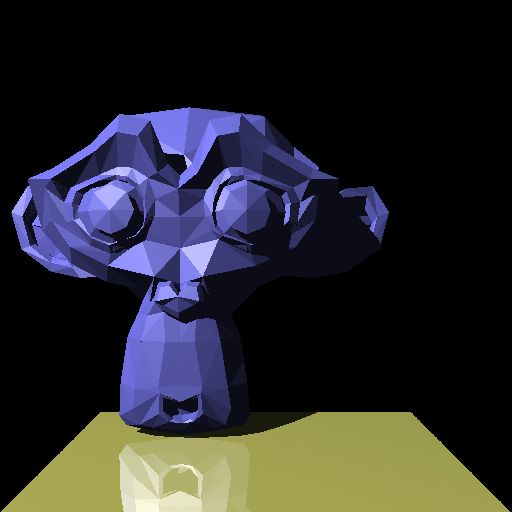
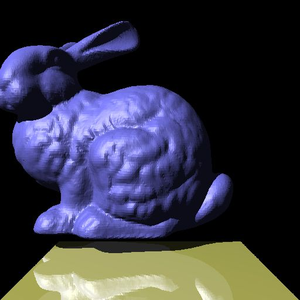

# Ray-Tracing

This project is built in C/C++ with IDE CodeBlocks when i took Advanced-CG in NTNU in 2018.  
The basic algorithm is backward ray-tracing Phong reflection model.  
The project is accelerated by KD-Tree which speeds up at least 100x when the number of recursion is 3.  
What is recursion light? You can see the object on another object's surface by the reflection.  
  
You can see the reflection on the surface of each ball.  

This project also surports rendering an 3D object which consists of numerous primitives.  
  
Primitive:900+, Resolution:512x512, Recursion:3, Runtime:12s  
  
Primitive:26000+, Resolution:512x512, Recursion:3, Runtime:50s  
The above is on the branch of Home  

# Load .obj and .mtl file  
The following is on the branch of HomeHome  
With the benefit of loading these two file, texture mapping can be done.  
Be carefull! In this project, there are still bugs in the texture mapping.  
  
Mapping an image to a plane is flawless.   
Wolmyeongdong,Daejeong City,Korea 

  
Banana  
  
Sofa  
